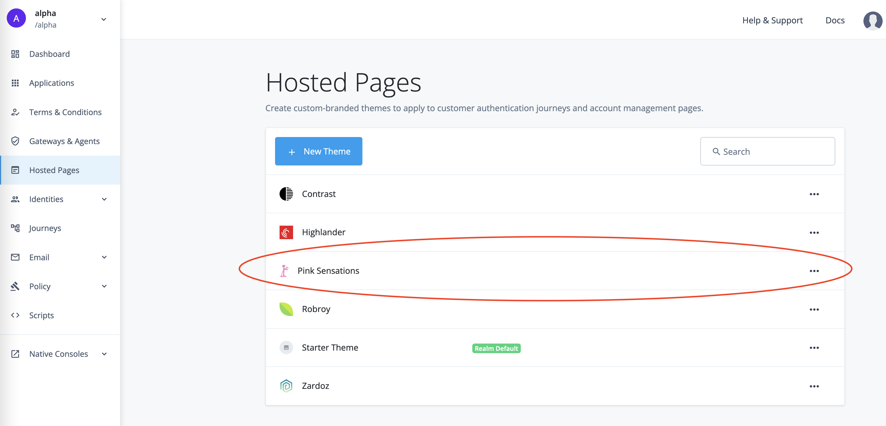

# ForgeRock Platform Scripting Examples

Supplemental examples to publicly available scripting resources, including:
* [Official Documentation](https://backstage.forgerock.com/docs/)
* [Knowledge Base](https://backstage.forgerock.com/knowledge/search?q=scripting)
* [ForgeRock Community](https://forgerock.connectedcommunity.org/search?executeSearch=true&SearchTerm=scripting&l=1)
* [Notes on Scripting in ForgeRock Access Management (AM)](https://developer.forgerock.com/docs/platform/how-tos/notes-scripting-forgerock-access-management-am-70)

## <a id="contents" name="contents"></a>Contents

* [ForgeRock Access Management (AM)](#am)
    * [Scripted Decisions](#am-scripted-decisions)
        * [Send Data (for example, a theme ID) to the Browser, and save it in `localStorage` with `ScriptTextOutputCallback`](#am-scripted-decisions-send-data-to-the-browser)
        * [Set a Theme with a Method of the `Action Interface`](#am-scripted-decisions-set-theme-withStage-Action-method)
        * [Get User Location from Their Postal or Physical Address and Save the Location Information in `sharedState`](#am-scripted-decisions-location-from-postal-or-physical-address)
        * [Get User Location from Their IP Address and Save the Location Information in `sharedState`](#am-scripted-decisions-location-from-ip-address)
        * [Set a Session Property Based on a Value Saved in `sharedState`](#am-scripted-decisions-set-session-property-from-sharedstate)
* [OIDC Claims](#am-oidc-claims)
    * [Saving AM User Session Information in a Custom Claim, and Resetting the Session Idle Timeout by Using the SSO Token](#am-oidc-claims-custom-session-claim)
        * [The Premise](#am-oidc-claims-custom-session-claim-premise)
        * [Trusted Relying Party (RP)](#am-oidc-claims-custom-session-claim-trusted-rp)
        * [Untrusted RP](#am-oidc-claims-custom-session-claim-untrusted-rp)
        * [Example of an ID Token With Session Information](#am-oidc-claims-custom-session-claim-id-token-example)
* [ForgeRock Identity Management (IDM)](#idm)
    * [Custom Endpoints](#idm-custom-endpoints)
        * [Custom Implementation of Knowledge Based Authentication (KBA)](#idm-custom-endpoints-custom-kba)
            * [Motivation](#idm-custom-endpoints-custom-kba-motivation)
            * [Custom Endpoint](#idm-custom-endpoints-custom-kba-custom-endpoint)

---

## <a id="am" name="am"></a>ForgeRock Access Management (AM)

[Back to Contents](#contents)

## <a id="am-scripted-decisions" name="am-scripted-decisions"></a>[Scripted Decisions](https://backstage.forgerock.com/docs/am/7.1/authentication-guide/scripting-api-node.html)

[Back to Contents](#contents)

* ### <a id="am-scripted-decisions-send-data-to-the-browser" name="am-scripted-decisions-send-data-to-the-browser"></a>Send Data (for example, a theme ID) to the Browser, and save it in `localStorage` with [ScriptTextOutputCallback](https://backstage.forgerock.com/docs/am/7.1/authentication-guide/authn-supported-callbacks.html#backchannel-callbacks)

    [Back to Contents](#contents)

    [Example Script](am/scripted-decision/src/set-localStorage-with-ScriptTextOutputCallback.js)

    An object with a single key is sent to the browser as a part of a script to be run on the client side. The script will save each object entry as an item in browser `localStorage`.

    In this instance, a (custom) theme name is saved in `localStorage`, so that the theme can be picked up by the Platform UI. Please see comments in the example script for further details.

    > Saving theme _name_ in `localStorage` with a client-side script will not take immediate effect; the Platform UI will pick up the theme information and translate it into the theme ID for the next request, after the callback form is submitted. If you want the theme to applied to the callback screen, you could save a theme _ID_ in `localStorage`. You can get available themes with REST call; for example:
    >
    > ```javascript
    > /**
    >  * Run in the browser console.
    >  */
    >
    > var requestOptions = {
    >   method: 'GET'
    > };
    >
    > fetch("https://openam-dx-kl02.forgeblocks.com/openidm/config/ui/themerealm", requestOptions)
    >   .then(response => response.json())
    >   .then(result => result.realm['alpha'].map(function (theme) {
    >       console.log(theme.name, theme._id, theme.isDefault);
    >   }))
    >   .catch(error => console.log('error', error));
    > ```
    >
    > Which will result in something like the following:
    >
    > ```
    > Contrast ba2d64e1-f1dc-489f-b6d1-91a06c284778 false
    > Highlander e0ec9eca-6b30-4b5e-b6e4-b25211a7e3f3 false
    > Pink Sensations c3e70128-ea6a-49c1-9d37-97b4f2745e99 true
    > Robroy bd5af604-f11b-4b16-b5e9-e40b8f267453 false
    > Starter Theme b54477be-10ac-4c45-bb4a-ce6ec6d16610 false
    > Zardoz 7349ff5d-cf42-43ab-9fc6-c3551b26ca8c false
    > ```
    >
    > Then, in your scripted decision, you can send a theme ID to the client side, instead of its name:
    >
    > ```javascript
    > // var themeNameOrId = 'Pink Sensations';
    > var themeNameOrId = 'c3e70128-ea6a-49c1-9d37-97b4f2745e99';
    > ```
    >
    > Note, however, that if you place your scripted decision in a Page Node instance, which has Stage setting, saving theme ID in localStorage will not take immediate effect, and will only apply to the next request, after the callback form is submitted.


* ### <a id="am-scripted-decisions-set-theme-withStage-Action-method" name="am-scripted-decisions-set-theme-withStage-Action-method"></a>Set a Theme with a Method of the [Action Interface](https://backstage.forgerock.com/docs/am/7.1/auth-nodes/core-action.html)

    [Back to Contents](#contents)

    [Example Script](am/scripted-decision/src/set-theme-withStage-Action-method.js)

    In a scripted decision callback screen, you can apply a theme using its name with immedeate effect by utilizing designated (but undocumented) [withStage](https://stash.forgerock.org/projects/OPENAM/repos/openam/browse/openam-auth-trees/auth-node-api/src/main/java/org/forgerock/openam/auth/node/api/Action.java#256) method of the Action Interface:

    ```javascript
    action = javaImports.Action.send(
        javaImports.ScriptTextOutputCallback(script)
    ).withStage('themeId=' + themeNameOrId).build();
    ```

    > You can find, update, or create a theme in the Platform Administrator under Hosted Pages. The theme name can serve as the theme ID in your scripted decision.
    >
    > 
    >
    > 
    >
    > 
    >

* ### <a id="am-scripted-decisions-location-from-postal-or-physical-address" name="am-scripted-decisions-location-from-postal-or-physical-address"></a>Get User Location from Their Postal or Physical Address and Save the Location Information in `sharedState`

    [Back to Contents](#contents)

    [Example Script](am/scripted-decision/src/get-location-from-postal-address.js)

* ### <a id="am-scripted-decisions-location-from-ip-address" name="am-scripted-decisions-location-from-ip-address"></a>Get User Location from Their IP Address and Save the Location Information in `sharedState`

    [Back to Contents](#contents)

    [Example Script](am/scripted-decision/src/get-location-from-ip-address.js)

    You can get the client IP address from the [X-Forwarded-For](https://developer.mozilla.org/en-US/docs/Web/HTTP/Headers/X-Forwarded-For) request header in deployments with AM behind a balance loader or a reverse proxy.

    Otherwise, in an "on premise" installation, you'll need to obtain the client IP address with a script running in the browser. Accessing the request object in the scripted decision context is currently not an option.


* ### <a id="am-scripted-decisions-set-session-property-from-sharedstate" name="am-scripted-decisions-set-session-property-from-sharedstate"></a>Set a Session Property Based on a Value Saved in `sharedState`

    [Back to Contents](#contents)

    [Example Script](am/scripted-decision/src/set-session-property.js)

## <a id="am-oidc-claims" name="am-oidc-claims"></a>[OIDC Claims](https://backstage.forgerock.com/docs/am/7.1/oidc1-guide/scripted-oidc-claims.html)

[Back to Contents](#contents)

* ### <a id="am-oidc-claims-custom-session-claim" name="am-oidc-claims-custom-session-claim"></a>Saving AM User Session Information in a Custom Claim, and Resetting the Session Idle Timeout by Using the SSO Token

    [Back to Contents](#contents)

    [Example Script](am/oidc-claims/src/get-and-reset-user-session.js)

    * #### <a id="am-oidc-claims-custom-session-claim-premise" name="am-oidc-claims-custom-session-claim-premise"></a>The Premise

        [Back to Contents](#contents)

        A third-party Relying Party (RP) might not be able to include the OpenID Provider (OP) cookies in requests made via the back channel. For example, including cookies in XHR requests from a different domain might be affected by the third-party cookies restrictions implemented in the browser, and for requests made from the server side a third-party application won't have access to the cookies set by the authorization server.

        Therefore, maintaining a user session at the OP via the back channel, silently, may need to be implemented without reliance on the OP's session cookies.

        In AM, the session information could be accessible in the context of the OIDC Claims script, which runs when ID token claims are being processed. Thus, the session information could be included in a custom ID token claim.

        The session context in the script is provided via the `session` binding, which represents an instance of the [SSOToken](https://backstage.forgerock.com/docs/am/7.1/apidocs/com/iplanet/sso/SSOToken.html) class.

        The `session` binding is currently available in the OIDC Claims script only when the session cookie is included in the OIDC authentication request; for example, during an interactive authorization code grant initiated in the front channel.

    * #### <a id="am-oidc-claims-custom-session-claim-trusted-rp" name="am-oidc-claims-custom-session-claim-trusted-rp"></a>Trusted Relying Party (RP)

        [Back to Contents](#contents)

        In these conditions, a _trusted_ RP application running in a different domain could maintain a (CTS-Based) user session at AM by providing the SSO token in a REST call to the [/json/sessions/](https://backstage.forgerock.com/docs/am/7.1/sessions-guide/managing-sessions-REST.html) endpoint.

        > To make this call silently from a browser, via an XHR request, you will need to add the session token header name (typically, iPlanetDirectoryPro) to the accepted headers in your CORS service configuration, in the AM console > CONFIGURE > Global Services > CORS Service > Secondary Configurations > _CORS configuration name_ > Accepted Headers.

        The SSO token could be obtained from the `session` object with its `getTokenID()` method.

        > For this to work, you will need the `com.iplanet.sso.providers.dpro.SSOTokenIDImpl` Java class to be allowed in the scripting engine configuration for the OIDC Claims Script type.

        Then, the session token could be included as a custom claim in the ID token sent to the RP.

        > With an RP that is a Single Page Application (SPA), storing the almighty SSO token in a browser should be well considered.

    * #### <a id="am-oidc-claims-custom-session-claim-untrusted-rp" name="am-oidc-claims-custom-session-claim-untrusted-rp"></a>Untrusted RP

        [Back to Contents](#contents)

        An untrusted third-party application, belonging to a business entity different from the one maintaining the authorization server, should not have access to the user's SSO token.

        _If/when_ the `session` binding were defined every time the ID token is issued, and the user session is not terminated, presence of a claim based on the session information could serve for the RP as an indication of an active user session, and its absence could be used by the RP to effect the single sign out functionality.

        In addition, the user session could be renewed from the script by sending a request to the `/json/sessions/` endpoint; thus, relieving a trusted RP from the responsibility to maintain the SSO token, and providing a safe option to renew the user session for an untrusted RP.

        > To make an HTTP request from the OIDC Claims script, you will need the following Java classes to be allowed in the scripting engine configuration for this script type:
        >
        > * `org.forgerock.http.protocol.*`
        > * `org.forgerock.http.Client`
        > * `org.forgerock.util.promise.PromiseImpl`
        >

    * #### <a id="am-oidc-claims-custom-session-claim-id-token-example" name="am-oidc-claims-custom-session-claim-id-token-example"></a>Example of an ID Token With Session Information:

        [Back to Contents](#contents)

        ```json
        {
            "at_hash": "7y7kdvI4P97EOrng0kn7jw",
            "sub": "85f8cdd0-59f5-4d4c-b6f9-5fe0857c0f8c",
            "auditTrackingId": "e6716ee2-32ee-4b32-ade6-19c7f3760c87-80295",
            "subname": "85f8cdd0-59f5-4d4c-b6f9-5fe0857c0f8c",
            "iss": "https://default.iam.example.com/am/oauth2",
            "tokenName": "id_token",
            "session": {
                "timeLeft": 7199,
                "tokenId": "VxYoSm207yxijytEXTW2HUkNCmM.*AAJTSQACMDIAAlNLABxsQTFuU3NtMW00L3QxWTFiZmUrU2l4aitDSEU9AAR0eXBlAANDVFMAAlMxAAIwMQ..*"
            },
            "given_name": "user",
            "nonce": "Y2u8L7AjPOknYx7ESDJwNaAi2-3xloI79UWiS4vp6BQ",
            "sid": "E90taYovhKEMRrTu0+mTc64/1KbrHnG0z1QLtlSqV9o=",
            "aud": "node-openid-client",
            "c_hash": "8kF3xWVmnEzh51oqDD2Vvw",
            "acr": "0",
            "org.forgerock.openidconnect.ops": "GQgVZAO0mKmrPBru9WYymF2nJwI",
            "s_hash": "EdwNOuHRohV2HCUbUYONbg",
            "azp": "node-openid-client",
            "auth_time": 1625071581,
            "name": "user 0",
            "realm": "/",
            "exp": 1625075181,
            "tokenType": "JWTToken",
            "iat": 1625071581,
            "family_name": "0"
        }
        ```

---

## <a id="idm" name="idm"></a>ForgeRock Identity Management (IDM)

[Back to Contents](#contents)

## <a id="idm-custom-endpoints" name="idm-custom-endpoints"></a>[Custom Endpoints](https://backstage.forgerock.com/docs/idm/7.1/scripting-guide/custom-endpoints.html)

[Back to Contents](#contents)

* ### <a id="idm-custom-endpoints-custom-kba" name="idm-custom-endpoints-custom-kba"></a>Custom Implementation of Knowledge Based Authentication (KBA)

    [Back to Contents](#contents)

    #### <a id="idm-custom-endpoints-custom-kba-motivation" name="idm-custom-endpoints-custom-kba-motivation"></a>Motivation

    [Back to Contents](#contents)

    * Allow for uploading existing hash into a custom field, and use it for validating users' answers to security questions.

        For example:

        ```json
        "frIndexedMultivalued3": [
            "{\"questionId\":\"3\",\"answer\":\"$2a$10$QYZRykd.7Is1DQx96hfUeOunRACQKPKCR21jpPND60eCmC6WObhSK\"}",
            "{\"questionId\":\"1\",\"answer\":\"$2a$10$U6kH.1ghtrtzJhpNQXretuQR4psfO6zC5ANnwfjsGiLAdp0ob1xeG\"}",
            "{\"questionId\":\"2\",\"answer\":\"$2a$10$noDIZAkLxArssuDOw8PJhOseQ5QrwXSAckq/U2s1Gbj6G8hvlPLES\"}"
        ]
        ```

    * Allow for use of hashing algorithms that are currently unsupported in a control environment, such as ForgeRock Identity Cloud (Identity Cloud).

        For example:

        ```javascript
        const javaImports = JavaImporter(
            java.security.SecureRandom,
            org.bouncycastle.crypto.generators.OpenBSDBCrypt,
            java.lang.String
        );

        // . . .

        /**
         * Create hash.
        */
        function hashAnswer(answer) {
            const secureRandom = new javaImports.SecureRandom();
            const salt = secureRandom.generateSeed(16);
            const answerJava = new javaImports.String(answer);

            return javaImports.OpenBSDBCrypt.generate('2a', answerJava.toCharArray(), salt, 10);
        }

        // . . .

        /**
         * Validate answers.
        */
        const hasIncorrectAnswer = requestQuestions.some(function (requestQuestion) {
            const requestAnswerJava = new javaImports.String(requestQuestion.answer);
            const correctAnswer = profileQuestions.find(function (profileQuestion) {
                return profileQuestion.questionId === requestQuestion.questionId;
            }).answer;

            return !javaImports.OpenBSDBCrypt.checkPassword(correctAnswer, requestAnswerJava.toCharArray());
        });
        ```

    #### <a id="idm-custom-endpoints-custom-kba-custom-endpoint" name="idm-custom-endpoints-custom-kba-custom-endpoint"></a>Custom Endpoint for Saving and Validating Answers to Security Questions

    [Back to Contents](#contents)

    * [Configure the Security Questions](https://backstage.forgerock.com/docs/idm/7.1/self-service-reference/selfservice-questions.html)

        For example, in the browser console during an active IDM Administrator session, update the KBA configuration over REST:

        [Update KBA Configuration - Example Script](idm/custom-endpoint/custom-kba/examples/configure-kba.js)

    * [Create a Custom Endpoint to Launch the Script](https://backstage.forgerock.com/docs/idcloud-idm/latest/scripting-guide/custom-endpoints.html)

        Upload the following script at the custom endpoint:

        [Custom Endpoint Script](idm/custom-endpoint/custom-kba/src/custom-endpoint-script.js)

        > This ^^^ script is using [OpenBSDBCrypt](https://javadox.com/org.bouncycastle/bcprov-jdk15on/1.53/org/bouncycastle/crypto/generators/OpenBSDBCrypt.html) with the following defaults:
        >
        > ```javascript
        > const bcryptVersion = '2a';
        > const bcryptCost = 10;
        > ```
        >

        For example, you can upload the script over REST using the following example as a template in the browser console during an active IDM Administrator session:

        [Create or Update Custom Endpoint - Example Script](idm/custom-endpoint/custom-kba/examples/create-custom-endpoint.js)

    * Optionally, load the existing hashed answers into the custom KBA field as an array of stringified JSON.

        For example:

        ```json
        "frIndexedMultivalued3": [
            "{\"questionId\":\"3\",\"answer\":\"$2a$10$QYZRykd.7Is1DQx96hfUeOunRACQKPKCR21jpPND60eCmC6WObhSK\"}",
            "{\"questionId\":\"1\",\"answer\":\"$2a$10$U6kH.1ghtrtzJhpNQXretuQR4psfO6zC5ANnwfjsGiLAdp0ob1xeG\"}",
            "{\"questionId\":\"2\",\"answer\":\"$2a$10$noDIZAkLxArssuDOw8PJhOseQ5QrwXSAckq/U2s1Gbj6G8hvlPLES\"}"
        ]
        ```

    * During registration, use PATCH request to the custom endpoint to hash plain-text answers with the custom algorithm, save them in the custom KBA field, and update the standard KBA property accordingly.

        See an example of doing so in the browser console during an active IDM Administrator session:

        [Hash and Save Answers in a Custom KBA Field - Example Script](idm/custom-endpoint/custom-kba/examples/save-kba-answers.js)

    * During authentication, use POST request to the custom endpoint to verify plain-text answers against hashes saved in the custom KBA field, and to update the standard KBA property accordingly if the correct answers were provided.

        See an example of doing so in the browser console during an active IDM Administrator session:

        [Verify Answers Against Hashes Saved in the Custom KBA Field - Example Script](idm/custom-endpoint/custom-kba/examples/verify-kba-answers.js)

    * During registration and authentication, optionally, pass in the custom KBA field name in the requests sent to the custom endpoint as the `field` parameter.

        For example (to be run in the browser authenticated as IDM Administrator):

        ```javascript
        var customEndpointName = '{custom-endpoint-name}';
        var userId = '{user-id}';
        var data = JSON.stringify([
            {
                operation: 'replace',
                field: '{custom-kba-field-name}',
                value: [
                    {
                        questionId: '{question-id}',
                        answer: '{answer}'
                    }
                ]
            }
        ]);

        await $.ajax({
            method: 'PATCH',
            url: '/openidm/endpoint/' + customEndpointName + '/' + userId,
            data: data,
            headers: {
                'x-requested-with': 'XMLHttpRequest',
                'Content-Type': 'application/json'
            }
        });
        ```

        If the `field` parameter is not provided, the custom endpoint script will substitute it with a default:

        ```javascript
        const defaultKbaCustomField = 'frIndexedMultivalued3';
        ```

        > You can also change the default in the [Custom Endpoint Script](idm/custom-endpoint/custom-kba/src/custom-endpoint-script.js#L104).

    * Optionally, when the standard KBA property has been populated for all users, use the out of the box KBA nodes to validate user's answers.

        


