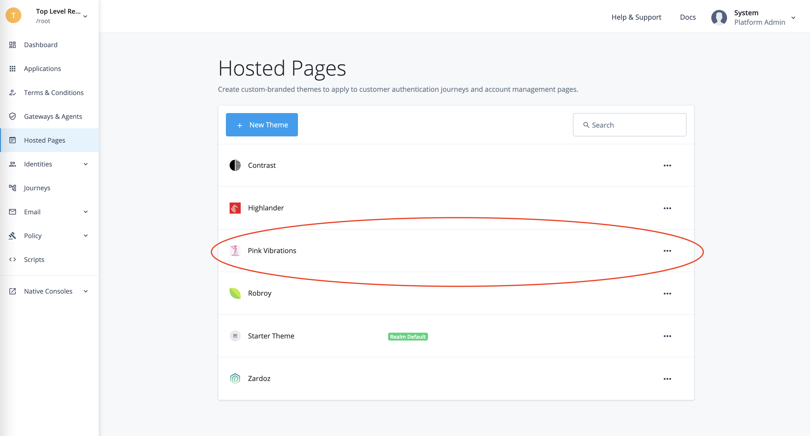
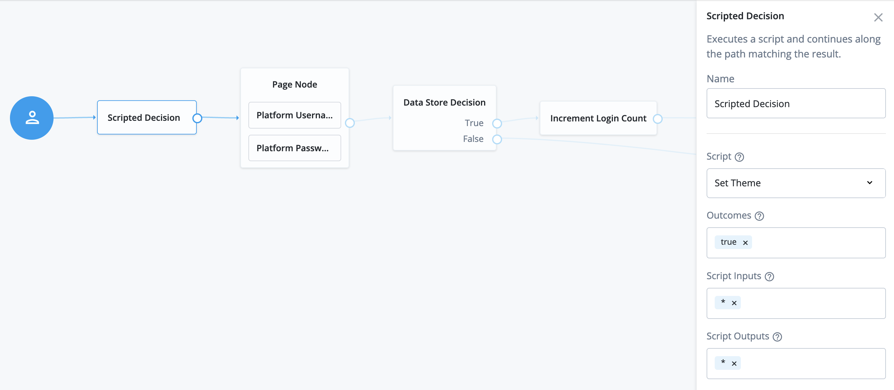
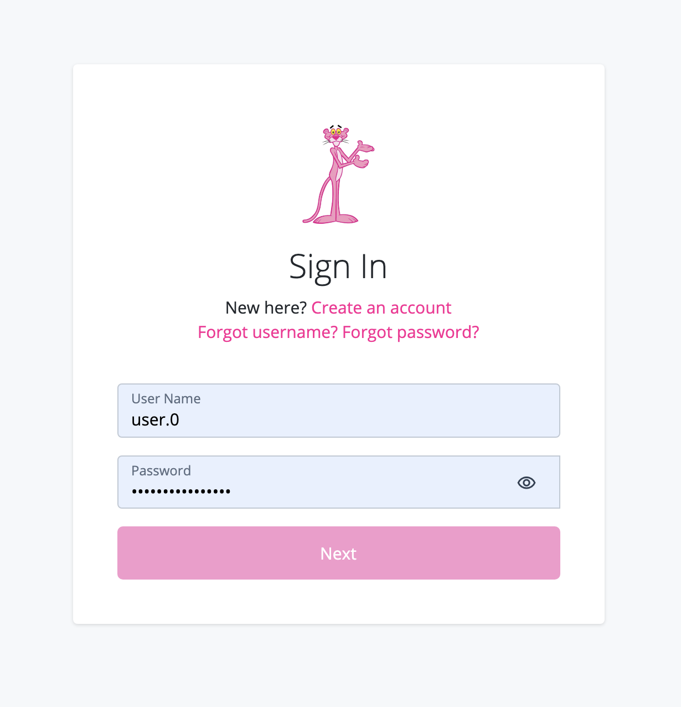

# ForgeRock Access Management (AM) [Scripted Decision](https://backstage.forgerock.com/docs/am/7.1/authentication-guide/scripting-api-node.html) Examples

## Contents

* [Send Data (for example, a theme ID) to the Browser with ScriptTextOutputCallback](#send-data-to-the-browser)

* [Get User Location from Their Postal or Physical Address and Save the Location Information in `sharedState`](#location-from-postal-or-physical-address)

* [Get User Location from Their IP Address and Save the Location Information in `sharedState`](#location-from-ip-address)

* [Set a Session Property Based on a Value Saved in `sharedState`](#set-session-property-from-sharedstate)

## Send Data (a theme ID) to the Browser with [ScriptTextOutputCallback](https://backstage.forgerock.com/docs/am/7.1/authentication-guide/authn-supported-callbacks.html#backchannel-callbacks)

[Back to Contents](#contents)

Example script: [src/set-theme.js](src/set-theme.js)

In this example, an object with a single key is sent to the browser to be saved in its `localStorage`.

For this instance, a (custom) theme is be defined in the Hosted Pages screen in a ForgeRock Platform deployment.

The theme ID is saved in the browser's `localStorage` with a script sent to the client side with a `ScriptTextOutputCallback` during authentication, so that the theme can be picked up by the Platform UI.

## Get User Location from Their Postal or Physical Address and Save the Location Information in `sharedState`

[Back to Contents](#contents)

Example script: [src/get-location-from-postal-address.js](src/get-location-from-postal-address.js)

## Get User Location from Their IP Address and Save the Location Information in `sharedState`

[Back to Contents](#contents)

Example script: [src/get-location-from-postal-address.js](src/get-location-from-ip-address.js)

You can get the client IP address from the [X-Forwarded-For](https://developer.mozilla.org/en-US/docs/Web/HTTP/Headers/X-Forwarded-For) request header in deployments with AM behind a balance loader or a reverse proxy.

Otherwise, in an "on premise" installation, you'll need to obtain the client IP address with a script running in the browser. Accessing the request object in the scripted decision context is currently not an option.

## Set a Session Property Based on a Value Saved in `sharedState`

[Back to Contents](#contents)

Example script: [src/set-session-property.js](src/set-session-property.js)
