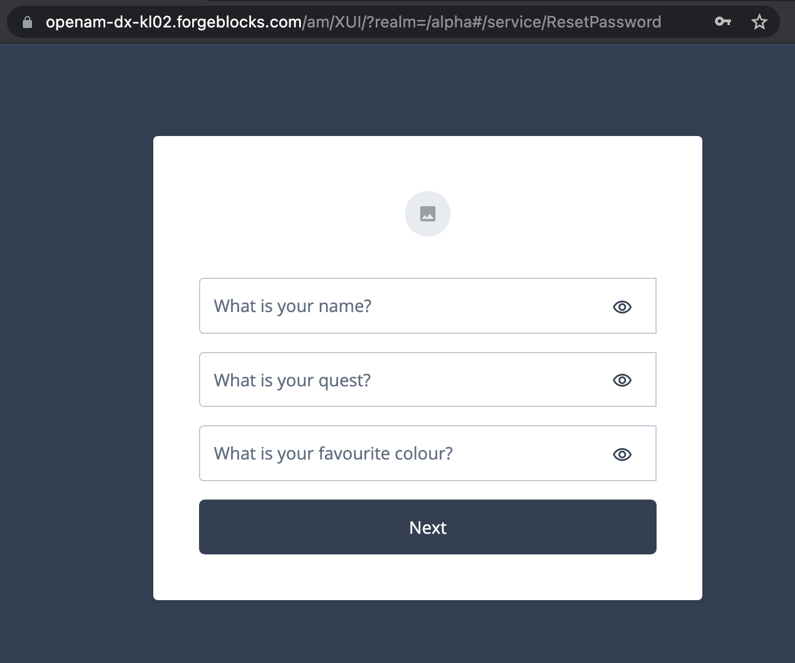

# Example of a Custom Knowledge Based Authentication (KBA) Implementation in ForgeRock Identity Management (IDM)

## Motivation

* Allow for uploading existing hash into a custom field and, use it for validating users' answers to security questions.

    For example:

    ```json
    "frIndexedMultivalued3": [
        "{\"questionId\":\"3\",\"answer\":\"$2a$10$QYZRykd.7Is1DQx96hfUeOunRACQKPKCR21jpPND60eCmC6WObhSK\"}",
        "{\"questionId\":\"1\",\"answer\":\"$2a$10$U6kH.1ghtrtzJhpNQXretuQR4psfO6zC5ANnwfjsGiLAdp0ob1xeG\"}",
        "{\"questionId\":\"2\",\"answer\":\"$2a$10$noDIZAkLxArssuDOw8PJhOseQ5QrwXSAckq/U2s1Gbj6G8hvlPLES\"}"
    ]
    ```

* Allow for use of hashing algorithms that are currently unsupported in a control environment, such as ForgeRock Identity Cloud (Identity Cloud).

    For example:

    ```javascript
    const javaImports = JavaImporter(
        java.security.SecureRandom,
        org.bouncycastle.crypto.generators.OpenBSDBCrypt,
        java.lang.String
    );

    // . . .

    /**
     * Create hash.
     */
    function hashAnswer(answer) {
        const secureRandom = new javaImports.SecureRandom();
        const salt = secureRandom.generateSeed(16);
        const answerJava = new javaImports.String(answer);

        return javaImports.OpenBSDBCrypt.generate('2a', answerJava.toCharArray(), salt, 10);
    }

    // . . .

    /**
     * Validate answers.
     */
    const hasIncorrectAnswer = requestQuestions.some(function (requestQuestion) {
        const requestAnswerJava = new javaImports.String(requestQuestion.answer);
        const correctAnswer = profileQuestions.find(function (profileQuestion) {
            return profileQuestion.questionId === requestQuestion.questionId;
        }).answer;

        return !javaImports.OpenBSDBCrypt.checkPassword(correctAnswer, requestAnswerJava.toCharArray());
    });
    ```

## Custom Endpoint for Saving and Validating Answers to Security Questions

* [Configure the Security Questions](https://backstage.forgerock.com/docs/idm/7.1/self-service-reference/selfservice-questions.html)

    For example, in the browser console, during an active IDM Administrator session, update the KBA configuration over REST:

    [examples/configure-kba.js](examples/configure-kba.js)

* [Create a Custom Endpoint to Launch the Script](https://backstage.forgerock.com/docs/idcloud-idm/latest/scripting-guide/custom-endpoints.html)

    Upload the following script at the custom endpoint:

    [src/custom-endpoint-script.js](src/custom-endpoint-script.js)

    For example, you can do so over REST using the following template in the browser console during an active IDM Administrator session:

    [src/create-custom-endpoint.js](src/create-custom-endpoint.js)

    The script is using [OpenBSDBCrypt](https://javadox.com/org.bouncycastle/bcprov-jdk15on/1.53/org/bouncycastle/crypto/generators/OpenBSDBCrypt.html) with the following defaults:

    ```javascript
    const bcryptVersion = '2a';
    const bcryptCost = 10;
    ```

    The custom KBA field name can be passed in a request sent to the custom endpoint, as the `field` parameter, or substituted with a default:

    ```javascript
    const defaultKbaCustomField = 'frIndexedMultivalued3';
    ```

* Optionally, load the existing hashed answers into the custom KBA field.

* Use PATCH request to the custom endpoint to hash plain-text answers with the custom algorithm, to save them in the custom KBA field, and to update the standard KBA property accordingly.

    See an example of doing so in the browser console, during an active IDM Administrator session:

    [examples/save-kba-answers.js](examples/save-kba-answers.js)

* Use POST request to the custom endpoint to verify plain-text answers against hashes saved in the custom KBA field, and to update the standard KBA property accordingly if the correct answers were provided.

    See an example of doing so in the browser console, during an active IDM Administrator session:

    [examples/verify-kba-answers.js](examples/verify-kba-answers.js)


* Optionally, when the standard KBA property has been populated, use the out of the box KBA nodes to validate user's answers.

    


